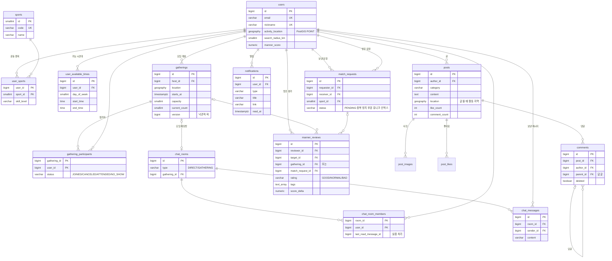

# FitMate

동네 운동 친구를 찾는 매칭, 채팅, 커뮤니티 서비스 (웹 + 앱)

## 🔗 라이브 데모

| | 주소 |
|---|---|
| **웹** | **https://fitmate-khj.vercel.app** |
| API 문서 (Swagger) | https://fitmate-api-dwrd.onrender.com/swagger-ui.html |

회원가입 후 이용할 수 있습니다.

- 무료 서버라 한동안 접속이 없었다면 첫 연결이 느릴 수 있습니다 (화면 위에 "서버를 깨우는 중" 안내가 뜹니다)
- 로컬에서 데모 데이터(사용자 30명, 모임, 커뮤니티 글, 채팅방)로 둘러보려면 아래 [로컬 실행](#로컬-실행)

## 기술 스택

| 영역 | 기술 |
|---|---|
| Backend | Java 17, Spring Boot 4, Spring Data JPA, Spring Security, WebSocket(STOMP), Flyway |
| DB / Cache | PostgreSQL + PostGIS, Redis |
| Web | React, Vite, TypeScript |
| App | React Native (Expo) — 예정 |
| 배포 | Vercel(웹), Render(API, 무료 · Docker), Supabase(DB·사진), Upstash(Redis) — 전부 무료 플랜 |

## 프로젝트 구조

```
fitmate/
├─ backend/            Spring Boot API 서버
├─ apps/
│  ├─ web/             React 웹
│  └─ mobile/          React Native 앱 (예정)
├─ packages/           웹/앱 공유 코드 (OpenAPI 클라이언트 등, 예정)
└─ docker-compose.yml  로컬 PostgreSQL(PostGIS) + Redis
```

## 로컬 실행

Docker Desktop을 켠 뒤, 처음 한 번만 `npm install`을 실행하고 아래 명령 하나로 전부 켭니다.

```bash
npm run dev
```
DB·Redis·Mailpit 컨테이너 → 백엔드(http://localhost:8081) → 웹(http://localhost:5173)이 한 터미널에서 차례로 뜨고, 로그는 `[api]`, `[web]`으로 구분됩니다. `Ctrl + C` 한 번으로 모두 종료됩니다.
Windows에서는 루트의 **`dev.cmd`를 더블클릭**해도 됩니다.

| 명령 | 설명 |
|---|---|
| `npm run dev` | 전체 실행 (컨테이너 + 백엔드 + 웹) |
| `npm run dev:api` / `npm run dev:web` | 백엔드만 / 웹만 실행 |
| `npm run test:api` | 백엔드 테스트 |
| `npm run infra:up` / `npm run infra:down` | 컨테이너 켜기 / 끄기 |

> Windows PowerShell에서 `npm` 실행이 막히면 `npm.cmd run dev`를 사용하세요.

- Swagger: http://localhost:8081/swagger-ui.html · 메일함(Mailpit): http://localhost:8025

웹 개발 서버는 `/api`, `/ws` 요청을 백엔드(기본 `http://localhost:8081`)로 프록시합니다.
백엔드 포트가 다르면 `BACKEND_URL=http://localhost:8082 npm run dev:web`처럼 지정하세요.
로그인 화면의 **데모 계정으로 로그인** 버튼(개발 모드 전용, 배포 빌드에는 없음)으로 `demo01`에 바로 로그인할 수 있습니다.

## 배포

Vercel(웹) · Render(API, Docker) · Supabase(DB·사진) · Upstash(Redis) 구성이고 **전부 무료 플랜**입니다. 단계별 방법은 **[DEPLOY.md](DEPLOY.md)**.

- `main`에 푸시하면 GitHub Actions가 백엔드 테스트 · 웹 빌드 · Docker 이미지 빌드를 확인하고, Render·Vercel이 자동 배포 (API 설정은 `render.yaml` Blueprint)
- **메모리 512MB(무료 플랜)에서 검증**: 512MB로 제한한 컨테이너에 사진 업로드 부하를 걸었더니 처음엔 컨테이너가 강제 종료(OOMKilled)됨. 원인은 큰 사진을 한꺼번에 여러 장 펼치는 이미지 처리와, 힙 밖 메모리(클래스 정보 · 스레드 · glibc arena 약 250MB)
  - 사진을 결과 크기의 2배까지만 줄여 읽기(`ImageReadParam` subsampling: 8000px 사진도 원본을 펼치지 않음)
  - 동시에 처리하는 사진 수 제한(Semaphore, 넘치면 잠시 대기 후 "잠시 후 다시" 안내)
  - 힙 40% · `MALLOC_ARENA_MAX=2` · Tomcat 스레드 30
  - 결과: 10명이 사진 4장씩 5번 동시에 올려도(사진 200장) 모두 성공, 최대 462MB, 헬스 체크 지연 없음
- 설정은 모두 환경 변수 (`backend/.env.example`, `apps/web/.env.example`)
- 컨테이너: 멀티 스테이지 빌드(JDK로 빌드 → JRE로 실행), root가 아닌 사용자로 실행, 컨테이너 메모리에 맞춘 힙 (`MaxRAMPercentage`)

### 요청 횟수 제한 (도배 방지)
- `@RateLimited(name, limit, windowSeconds)`를 컨트롤러 메서드에 붙이면 인터셉터가 사용자별(로그인 전 API는 IP별)로 센다
- Redis `INCR` + 첫 요청 `EXPIRE`를 **Lua 스크립트 한 번**으로 실행해서, 서버 여러 대에서도 합산되고 30개 동시 요청 중 정확히 한도만큼만 통과 (테스트로 검증). 두 명령 사이에 서버가 죽어 만료 없는 키가 남는 문제도 없음
- 넘으면 429와 `Retry-After` 헤더. WebSocket(STOMP)으로 보내는 채팅도 REST와 같은 한도를 공유
- 예: 글 10개/10분, 댓글 30개/5분, 채팅 60개/1분, 매칭 요청 30개/1시간, 회원가입 IP당 10번/1시간

## 웹 화면

| 화면 | 내용 |
|---|---|
| 로그인 · 회원가입 | 브랜드 소개 패널 + 폼, 필드별 입력 오류 표시, 가입 후 프로필 설정으로 안내 |
| 운동 메이트 | 매칭 점수 링, 점수 내역(거리·실력·시간·매너), 공통 종목 실력 비교, 종목·반경 필터, 요청 모달 |
| 커뮤니티 | 우리 동네 / 전체 피드, 분류(운동 인증·질문·후기·자유) 필터, 무한 스크롤, 사진 4장까지 글쓰기, 좋아요(즉시 반영), 댓글·답글, 글 고치기·지우기 |
| 다른 사람 프로필 | 매너 온도, 받은 칭찬, 운동 종목·실력, 쓴 글, 차단·신고 (글·댓글·모임 참여자·채팅에서 이름을 누르면 이동) |
| 모임 | 근처 모임 목록 / **지도 보기**(OpenStreetMap, 누르면 상세로), 내 모임 탭, 정원 진행 바, 모임 만들기(날짜 칩·시간·정원·장소 검색), 상세(참여자·참여/나가기/취소·단체 채팅방), 함께 운동한 메이트 평가 |
| 매칭 요청 | 받은/보낸 요청 탭, 상태 필터, 수락하면 바로 채팅방으로 이동 |
| 관리자 | 운영 현황 카드, 신고 목록(대기·완료), 처리(문제 없음·경고·7일·영구 정지), 정지 해제, 글 숨기기 (관리자에게만 메뉴 표시) |
| 알림 | 종 아이콘 + 안 읽은 수, 종류별 켜기·끄기(프로필), 최근 알림 목록, 누르면 해당 화면으로 이동, 모두 읽음. 새 알림은 실시간 토스트 |
| 채팅 | 1:1 · 모임 단체방, 실시간 수신, 안 읽은 수 배지, 날짜 구분선, 연속 메시지 묶기, 이전 대화 불러오기, 이모티콘(최근 사용, 이모티콘만 보내면 크게 표시), 사진(버튼·붙여넣기, 크게 보기), 읽음 표시(단체방은 안 읽은 사람 수), 상대 접속 상태 |
| 내 프로필 | 받은 매너 칭찬, 차단 목록·해제, 회원 탈퇴, 프로필 사진(즉시 저장), 기본 정보, 활동 지역(전국 자동완성 검색), 운동 종목·실력, 요일×시간대 표로 운동 가능 시간 선택 |

- **기술**: React 19, Vite, TypeScript, Tailwind CSS v4, TanStack Query, React Router, STOMP.js, Pretendard
- **반응형**: 데스크톱은 사이드바, 모바일은 하단 탭 5개(매칭 요청·알림은 상단 아이콘)와 하단 시트 모달
- **지도는 필요할 때만 로드**: Leaflet(약 150KB)은 지도 보기를 누를 때 따로 불러와서 첫 화면 용량에 포함하지 않음
- **토큰 자동 재발급**: 여러 요청이 동시에 401을 받아도 재발급은 한 번만 수행 (서버 리프레시 토큰이 1회용이라 중복 재발급 시 로그아웃되는 문제 방지)
- **실시간 연결**: 로그인하면 내 모든 채팅방을 구독해서 다른 화면에서도 안 읽은 수 배지가 실시간 갱신. 연결이 끊기면 REST로 전송
- **한글 입력**: IME 조합 중 Enter는 전송하지 않아 마지막 글자가 중복 전송되는 문제 방지

## 테스트

### 자동 테스트
```bash
cd backend && ./gradlew test
```
Testcontainers로 실제 PostGIS와 Redis 컨테이너를 띄워서 통합 테스트를 실행합니다. Docker가 실행 중이어야 합니다.
결과 리포트: `backend/build/reports/tests/test/index.html`

GitHub에 푸시하면 GitHub Actions에서도 같은 테스트가 자동으로 실행됩니다 (저장소의 **Actions** 탭).

### 브라우저 E2E 테스트 (Playwright)
실제 브라우저로 핵심 흐름을 끝까지 확인합니다. 백엔드·Mailpit이 떠 있어야 합니다 (`npm run dev`).
```bash
npm run test:e2e
```
| 시나리오 | 확인하는 것 |
|---|---|
| 회원가입 | 이메일 미인증이면 막힘 → Mailpit에 온 코드로 인증 → 가입 → 프로필 설정 화면 |
| 1:1 실시간 채팅 | 브라우저 두 개(각자 로그인). 새로고침 없이 메시지 도착, 상대가 읽으면 "1"이 사라짐 |
| 커뮤니티 | 글쓰기 → 다른 사용자가 좋아요·댓글 → 글쓴이에게 실시간 알림 토스트, 알림 눌러 이동 |

- CI(GitHub Actions)에서는 PostGIS·Redis·Mailpit을 서비스 컨테이너로 띄우고 API를 실행한 뒤 같은 테스트를 돌립니다
- **E2E가 잡은 버그**: 성별 선택 버튼을 화면 읽기 프로그램이 "성별 여성"으로 읽고 있었음 (`<label>` 안에 버튼 여러 개 → 첫 버튼이 라벨 이름을 가져감). 버튼 묶음은 `role="group"`으로 바꾸고 선택 상태(`aria-pressed`)를 추가

### 부하 테스트 (k6)
```bash
docker run --rm -i -e BASE_URL=http://host.docker.internal:8081 grafana/k6 run - < scripts/k6/browse.js
```
로그인한 사용자들이 추천·피드·모임·채팅방·알림 화면을 동시에 불러오는 상황 (로컬 PC, 데모 데이터 기준)

| 시나리오 | 요청 수 | 처리량 | 오류 | p95 응답 시간 |
|---|---|---|---|---|
| 50명이 1초씩 쉬며 둘러보기 (70초) | 13,460 | 185 req/s | 0% | 11ms (추천 13ms) |
| 100명이 쉬지 않고 요청 (`-e MODE=stress`, 30초) | 54,205 | **1,683 req/s** | 0% | 76ms (추천 80ms) |

배포 서버(Render 무료, 메모리 512MB)는 이보다 느리지만, 512MB 제한 컨테이너에서도 사진 업로드 부하까지 버티는 것을 따로 확인했습니다 ([배포](#배포)).

### Swagger로 직접 테스트하기
1. Docker Desktop 실행 후 `npm run infra:up`
2. `cd backend && ./gradlew bootRun`
3. 브라우저에서 http://localhost:8081/swagger-ui.html 열기
4. **회원가입** `POST /api/auth/signup` → Try it out
   ```json
   {"email": "test@fitmate.com", "password": "password123", "nickname": "테스터"}
   ```
5. **로그인** `POST /api/auth/login` → 응답의 `accessToken` 복사
6. 오른쪽 위 **Authorize** 버튼 → 토큰 붙여넣기 (`Bearer ` 없이 토큰만)
7. 이제 인증이 필요한 API를 호출할 수 있습니다. 예시:
   - `PUT /api/users/me/location`
     ```json
     {"latitude": 37.5445, "longitude": 127.0557, "areaName": "서울 성동구 성수동"}
     ```
   - `PUT /api/users/me/sports` (종목 ID는 `GET /api/sports`에서 확인)
     ```json
     {"sports": [{"sportId": 1, "skillLevel": "BEGINNER"}, {"sportId": 2, "skillLevel": "ADVANCED"}]}
     ```
   - `PUT /api/users/me/available-times`
     ```json
     {"availableTimes": [{"dayOfWeek": "MONDAY", "startTime": "19:00", "endTime": "21:00"}]}
     ```
   - `GET /api/users/me`로 결과 확인

> Windows PowerShell에서는 `./gradlew` 대신 `.\gradlew.bat`을 사용하세요.

## API

| Method | Path | 설명 | 인증 |
|---|---|---|---|
| POST | `/api/auth/signup` | 회원가입 | |
| POST | `/api/auth/login` | 로그인 (액세스 30분 / 리프레시 14일) | |
| POST | `/api/auth/refresh` | 토큰 재발급 (리프레시 토큰 교체) | |
| POST | `/api/auth/logout` | 로그아웃 (리프레시 토큰 폐기) | |
| POST | `/api/auth/find-login-id` | 아이디 찾기 (등록한 이메일로 발송) | |
| POST | `/api/auth/password-reset/request` | 비밀번호 재설정 코드 요청 | |
| POST | `/api/auth/password-reset/confirm` | 코드 확인 후 비밀번호 재설정 | |
| GET | `/api/locations/search` | 지역 검색 (자동완성) | |
| GET | `/api/sports` | 운동 종목 목록 | |
| GET | `/api/users/me` | 내 프로필 | ✅ |
| PUT | `/api/users/me` | 프로필 전체 저장 (한 트랜잭션) | ✅ |
| PATCH | `/api/users/me` | 프로필 수정 (보낸 필드만) | ✅ |
| PUT | `/api/users/me/location` | 활동 지역 설정 | ✅ |
| PUT | `/api/users/me/sports` | 운동 종목·실력 설정 | ✅ |
| PUT | `/api/users/me/available-times` | 운동 가능 시간대 설정 | ✅ |
| GET | `/api/users/{userId}` | 다른 사용자 프로필 (이메일·좌표 비공개) | ✅ |
| GET | `/api/matching/recommendations` | 내 주변 운동 친구 추천 (`sportId`, `radiusKm`, `limit`) | ✅ |
| POST | `/api/match-requests` | 매칭 요청 보내기 | ✅ |
| GET | `/api/match-requests/received` · `/sent` | 받은·보낸 요청 목록 (`status`) | ✅ |
| POST | `/api/match-requests/{id}/accept` | 수락 → 1:1 채팅방 생성 | ✅ |
| POST | `/api/match-requests/{id}/reject` · `/cancel` | 거절 · 취소 | ✅ |
| GET | `/api/chat-rooms` | 내 채팅방 목록 (상대방, 마지막 메시지, 안 읽은 수) | ✅ |
| GET | `/api/chat-rooms/{id}/messages` | 메시지 목록 (커서 페이지네이션) | ✅ |
| POST | `/api/chat-rooms/{id}/messages` | 메시지 보내기 (REST) | ✅ |
| POST | `/api/chat-rooms/{id}/images` | 사진 보내기 (multipart) | ✅ |
| POST | `/api/chat-rooms/{id}/read` | 읽음 처리 | ✅ |
| PUT · DELETE | `/api/users/{id}/block` | 차단 · 해제 | ✅ |
| GET | `/api/users/me/blocks` | 내가 차단한 사용자 | ✅ |
| POST | `/api/users/{id}/report` | 신고 (사유, 내용, 함께 차단) | ✅ |
| POST | `/api/users/me/withdrawal` | 회원 탈퇴 (비밀번호 확인) | ✅ |
| GET | `/api/users/presence?userIds=1,2` | 접속 상태 (현재 접속중 / 마지막 접속 시각) | ✅ |
| POST · DELETE | `/api/users/me/profile-image` | 프로필 사진 올리기 · 삭제 (multipart) | ✅ |
| POST | `/api/gatherings` | 모임 만들기 (단체 채팅방 함께 생성) | ✅ |
| GET | `/api/gatherings` · `/mine` | 근처 모임 (`sportId`, `radiusKm`) · 내 모임 | ✅ |
| GET | `/api/gatherings/{id}` | 모임 상세 (참여자, 단체 채팅방) | ✅ |
| POST · DELETE | `/api/gatherings/{id}/participants` · `/participants/me` | 참여 (선착순) · 나가기 | ✅ |
| DELETE | `/api/gatherings/{id}` | 모임 취소 (모임장, 참여자에게 알림) | ✅ |
| GET | `/api/manner/pending` | 평가할 상대 (끝난 모임 참여자 · 1:1 매칭 상대) | ✅ |
| POST | `/api/manner/reviews` | 매너 평가 | ✅ |
| GET | `/api/users/{id}/manner` | 매너 온도 · 받은 칭찬 태그 | ✅ |
| GET | `/api/notifications` | 알림 목록 (커서) + 안 읽은 수 | ✅ |
| GET · PUT | `/api/notifications/settings` | 끈 알림 종류 (MATCH · GATHERING · MANNER · COMMUNITY) | ✅ |
| POST | `/api/posts` | 글쓰기 (multipart: `post` JSON + `images` 최대 4장) | ✅ |
| GET | `/api/posts` | 피드 (`scope`=NEARBY·ALL, `category`, `sportId`, `authorId`, `cursor`) | ✅ |
| GET · PUT · DELETE | `/api/posts/{id}` | 글 상세 · 고치기 · 지우기 (작성자만) | ✅ |
| PUT · DELETE | `/api/posts/{id}/like` | 좋아요 · 취소 | ✅ |
| GET · POST | `/api/posts/{id}/comments` | 댓글 목록(답글 묶음) · 댓글·답글 쓰기 | ✅ |
| DELETE | `/api/comments/{id}` | 댓글 지우기 | ✅ |
| POST | `/api/auth/email-verification/request` · `/confirm` | 이메일 인증 코드 보내기 · 확인(인증 토큰 발급) | |
| GET | `/api/admin/stats` | 운영 현황 | 관리자 |
| GET | `/api/admin/reports` | 신고 목록 (`pending`, `cursor`) | 관리자 |
| POST | `/api/admin/reports/{id}/resolve` | 신고 처리 (DISMISS · WARN · SUSPEND_7D · SUSPEND_PERMANENT) | 관리자 |
| POST | `/api/admin/users/{id}/unsuspend` | 정지 해제 | 관리자 |
| POST | `/api/admin/posts/{id}/hide` · `/unhide` | 글 숨기기 · 해제 | 관리자 |
| POST | `/api/notifications/{id}/read` · `/read-all` | 읽음 · 모두 읽음 | ✅ |

**WebSocket (STOMP)**: `ws://localhost:8081/ws`
- 연결: CONNECT 헤더에 `Authorization: Bearer <accessToken>`
- 구독: `/topic/chat-rooms/{roomId}` (메시지), `/topic/chat-rooms/{roomId}/reads` (읽음 위치) — 채팅방 멤버만 가능, 에러는 `/user/queue/errors`, 알림은 `/user/queue/notifications`
- 전송: `/app/chat-rooms/{roomId}/messages` ← `{"content": "..."}`

전체 명세는 서버 실행 후 `http://localhost:8081/swagger-ui.html`에서 확인할 수 있습니다.

### 인증 설계
- **액세스 토큰**: Spring Security OAuth2 Resource Server + HS256 JWT. 직접 만든 필터 대신 표준 구현 사용
- **리프레시 토큰**: JWT가 아닌 랜덤 문자열을 Redis에 저장 (TTL 14일)
  - 원문이 아닌 SHA-256 해시를 키로 저장해 Redis가 유출돼도 토큰을 재사용할 수 없음
  - `GETDEL`로 원자적으로 꺼내고 삭제 → 같은 토큰으로 동시에 재발급을 요청해도 한 번만 성공 (테스트로 검증)
- **웹은 HttpOnly 쿠키**: 리프레시 토큰을 JavaScript가 읽을 수 없는 쿠키(`HttpOnly; Secure; SameSite=Strict; Path=/api/auth`)로만 주고받고, 액세스 토큰은 메모리에만 둠 → XSS로 토큰을 훔쳐 갈 수 없음. 새로고침하면 쿠키로 다시 발급
  - 웹(vercel.app)과 API(onrender.com)는 다른 사이트라 쿠키가 서드파티 쿠키가 되어 **Safari가 막음** → Vercel이 `/api`를 API로 전달(rewrite)해서 같은 사이트로 만들고, 실시간 채팅(WebSocket)만 API에 직접 연결
  - 프록시 뒤에서는 API가 보는 IP가 Vercel이 되므로, IP별 제한은 `x-vercel-forwarded-for` 헤더로 사용자 IP를 읽음
  - 앱 등 다른 클라이언트는 헤더(`X-Auth-Mode: cookie`)를 안 보내면 지금처럼 응답 본문으로 받음. 예전 버전(localStorage)으로 로그인해 둔 사용자는 첫 방문 때 쿠키로 옮기고 localStorage를 지움
  - 탭 두 개가 동시에 재발급하면 한쪽은 이미 교체된 쿠키로 실패하므로, 잠시 뒤 한 번 더 시도
- **가입 이메일 인증**: 6자리 코드 확인 → 30분짜리 1회용 인증 토큰 → 가입·이메일 변경 요청에 함께 보내면 `GETDEL`로 확인하고 지움. 인증 없이는 남의 이메일로 가입해서 계정 찾기 메일이 엉뚱한 곳으로 갈 수 있기 때문
- **로그인 실패**: 계정이 없을 때와 비밀번호가 틀릴 때 같은 에러를 줘서 가입 여부를 노출하지 않음
- **중복 가입**: 사전 검사 + DB 유니크 제약 이중 방어. 같은 이메일 동시 가입 10건 중 1건만 성공 (테스트로 검증)

### 계정 찾기 설계
- **가입 여부 비노출**: 아이디·이메일이 가입돼 있든 아니든 항상 같은 응답(202)을 주고 메일만 조건부 발송. 메일은 `@Async`로 보내서 응답 시간 차이로도 알 수 없게 함
- **인증 코드**: 6자리 코드를 해시로 Redis에 저장(10분 TTL). `HINCRBY`로 시도 횟수를 원자적으로 세서 5번 틀리면 폐기 (무차별 대입 방지), 성공하면 즉시 삭제 (재사용 방지)
- **재요청 제한**: 같은 대상은 1분에 한 번 (`SET NX EX`)
- **비밀번호 변경 시 모든 기기 로그아웃**: 사용자별 리프레시 토큰 목록(Redis Set)을 관리해 한 번에 폐기
- **로컬 메일 확인**: docker-compose의 Mailpit이 메일을 받아서 http://localhost:8025 에서 볼 수 있음 (실제 발송 안 됨)
- **배포 메일은 HTTP API**: Render 무료 플랜은 SMTP 포트(25·465·587)를 막아서, `BREVO_API_KEY`가 있으면 Brevo HTTPS API로 보냄. 메일 내용(템플릿)과 발송 방법(`MailTransport`: SMTP / Brevo)을 분리해 설정으로 바꿔 끼움

### 안전 · 계정 보호
- **추천 제외**: 차단 관계(어느 쪽이든), 이미 매칭된 사람, 대기 중인 요청이 있는 사람을 반경 검색 SQL 안에서 `NOT EXISTS`로 제외
- **차단**: 추천·매칭 요청·채팅에서 서로 차단. 차단 즉시 대기 중인 요청을 한 번의 UPDATE로 취소하고, 차단한 사람의 목록에서는 채팅방을 숨김. 상대에게 차단 사실을 알리지 않음
- **신고**: 사유와 함께 저장, 검토 중 중복 신고는 부분 유니크 인덱스로 차단. 신고하면서 바로 차단 가능
- **회원 탈퇴**: 비밀번호 확인 후 계정과 개인정보를 완전히 삭제(`ON DELETE CASCADE`), 상대방 채팅방의 대화는 남기고 보낸 사람만 비움(`SET NULL`), 신고 기록은 운영 검토용으로 유지, 프로필 사진 파일은 커밋 후 삭제, 모든 기기 로그아웃
- **로그인 시도 제한**: 같은 아이디 5회 / 같은 IP 20회 실패 시 15분 잠금 (Redis `INCR` + TTL). 아이디만 제한하면 아이디를 바꿔 가며 시도하거나 남의 계정을 일부러 잠글 수 있어 IP 제한을 함께 둠. 프록시 뒤에서는 `forward-headers-strategy: native`로 내부 프록시가 붙인 IP만 신뢰해 헤더 위조로 제한을 피할 수 없게 함

### 관리자 · 신고 처리
- **관리자 지정**: `ADMIN_LOGIN_IDS` 환경 변수의 아이디를 서버 시작 때 ADMIN으로 맞춤. 권한은 요청마다 DB에서 확인해서, 권한을 뺏으면 토큰을 새로 받기 전이라도 바로 막힘
- **신고 처리**: 문제 없음 / 경고 / 7일 정지 / 영구 정지. 신고 하나를 처리하면 같은 사람의 검토 대기 신고를 조건부 UPDATE 한 번으로 함께 처리 → 관리자 두 명이 동시에 눌러도 한 번만 반영
  - 신고당한 사람에게 경고 알림(설정에서 끌 수 없는 운영 알림), 신고자에게 처리 결과 알림
  - 정지하면 로그인·토큰 재발급을 막고 모든 기기의 리프레시 토큰을 폐기. 정지 여부는 비밀번호가 맞을 때만 알려서 계정 존재를 떠볼 수 없게 함. 관리자 계정은 정지할 수 없음
- **글 숨김**: 삭제하지 않고 숨겨서 되돌릴 수 있음. 숨긴 글은 피드·상세·댓글에서 모두 제외
- **운영 현황**: 가입자, 최근 7일 가입·글·메시지, 매칭, 모임, 대기 신고, 정지 계정 수를 한 번의 SQL로

### 읽음 표시 · 접속 상태
- **읽음 "1"**: 메시지 목록에 상대의 마지막 읽음 위치를 함께 주고, 상대가 읽거나 답장하면 읽음 위치를 커밋 후 Redis로 발행 → `/reads` 토픽으로 실시간 전달. 읽음 위치가 실제로 앞으로 움직였을 때만 발행
- **접속 상태**: WebSocket 연결 = 접속. Redis 해시에 연결마다 만료 시각을 기록해 **여러 탭**(하나 닫아도 접속중)과 **서버 장애**(heartbeat 30초, 90초 지나면 만료로 보고 정리)를 모두 처리
- **경쟁 상황 수정**: 끊김 처리 순서(연결 삭제 → 마지막 접속 기록)를 반대로 바꿈. 그 사이 조회에서 "오프라인인데 마지막 접속 없음"이 보이던 문제를 WebSocket E2E 테스트가 잡아냄

### 사진 업로드
- **브라우저에서 먼저 축소**: 업로드 전에 긴 변 1600px JPEG로 줄여서 전송량을 줄이고, 휴대폰 사진의 회전(EXIF Orientation)을 이때 적용
- **서버에서 재검증·재인코딩**: 확장자가 아니라 파일 앞부분(매직 넘버)으로 JPEG/PNG 확인 → 픽셀 크기를 먼저 읽어 거대한 이미지는 디코딩 전에 거절(압축 폭탄 방지) → 다시 인코딩하면서 **촬영 위치(GPS) 등 EXIF 메타데이터 제거**
- **프로필 사진**: 가운데를 정사각형으로 잘라 512px. 바꾸거나 지우면 이전 파일은 **커밋 후** 삭제, DB 저장이 실패하면 방금 올린 파일을 **롤백 시** 삭제해서 DB와 저장소가 어긋나지 않음
- **저장소 추상화**: 개발은 로컬 폴더(`/files/**`), 배포는 S3 호환 저장소(Supabase Storage·AWS S3·R2)를 `STORAGE_TYPE`으로 전환. 파일명이 UUID라 1년 `immutable` 캐시
- **테스트**: EXIF 제거·압축 폭탄·파일 정리는 통합 테스트로, S3 구현은 S3Mock 컨테이너로 검증

### 지역 검색
- `KAKAO_REST_API_KEY`가 있으면 카카오 로컬 API(주소 + 키워드 검색), 결과는 Redis에 하루 캐시
- 키가 없거나 외부 API가 실패하면 내장 목록으로 대체: **전국 시 · 시군구 · 읍면동 3,827곳** + 주요 역·명소
  - 통계청 행정동 경계에서 동마다 넓이 가중 무게중심을 계산해 생성 (`backend/scripts/generate_kr_areas.py`)
  - "망원동"처럼 부르는 이름으로도 행정동(망원1동, 망원2동)을 찾도록 숫자·"N가"를 뺀 별칭으로도 검색
  - 결과는 이름 일치 → 주소 일치 순, 같은 순위면 넓은 지역(시 → 구 → 역 → 동) 먼저
- 저장하는 지역명은 동 단위까지만 잘라서(번지 제외) 개인 위치를 남기지 않음

### 매칭 설계
**점수(100점) = 거리 35 + 실력 30 + 운동 시간 25 + 매너 10**

| 항목 | 계산 |
|---|---|
| 거리 | 가까울수록 높음, 검색 반경 끝이면 0점 |
| 실력 | 같은 수준 30 / 한 단계 차이 15 / 두 단계 차이 0 |
| 운동 시간 | 같은 요일에 겹치는 시간 합계, 주 3시간 이상이면 만점 |
| 매너 | 매너 점수 30 이하 0점 ~ 50 이상 만점 |

- **반경 검색**: `ST_DWithin` + GIST 인덱스 (`EXPLAIN`으로 `Index Scan using idx_users_activity_location` 확인)
- **2단계 처리**: DB에서 반경 안 후보를 가까운 순 200명까지 거르고 겹치는 시간까지 계산 → 점수는 애플리케이션에서 계산. 가중치를 바꾸기 쉽고 점수 계산기를 DB 없이 단위 테스트할 수 있음
- **위치 보호**: 거리는 0.5km 단위로 올림해서 보여줘서 여러 지점에서 거리를 재 정확한 위치를 역추적(삼각측량)하기 어렵게 함
- **시간대 버그 수정**: `hibernate.jdbc.time_zone=UTC` 설정 때문에 운동 가능 시각(`time`)이 9시간 밀려 저장되던 문제를 데모 데이터 생성 중 발견. 설정을 제거하고, CI(UTC)에서도 재현되도록 테스트 JVM 시간대를 KST로 고정한 뒤 DB 저장값을 직접 검증하는 회귀 테스트 추가

### 매칭 요청 · 채팅 설계
```
클라이언트 ─STOMP SEND→ 서버 A ─저장(DB)→ 커밋 후 ─PUBLISH→ Redis "chat:messages"
                                                         │
                          ┌──────────────────────────────┴──────────────┐
                        서버 A (SUBSCRIBE)                          서버 B (SUBSCRIBE)
                          └─→ /topic/chat-rooms/{id} 구독자           └─→ 구독자
```
- **Redis Pub/Sub**: 서버가 여러 대여도 다른 서버에 연결된 사용자에게 메시지가 전달됨
- **커밋 후 발행**: `@TransactionalEventListener(AFTER_COMMIT)`로 DB 커밋이 끝난 메시지만 발행 → 롤백된 메시지 전송 방지
- **WebSocket 인증**: 브라우저 WebSocket은 핸드셰이크에 헤더를 못 붙이므로 STOMP CONNECT 프레임에서 JWT 검증, SUBSCRIBE 시 채팅방 멤버 여부 확인
- **요청 처리 동시성**: 수락·거절·취소는 `SELECT ... FOR UPDATE`(비관적 락)로 직렬화. 수락과 취소가 동시에 와도 하나만 성공, 같은 요청을 동시에 5번 수락해도 채팅방은 1개 (테스트로 검증)
- **1:1 채팅방 유일성**: `"작은ID:큰ID"` 키에 유니크 제약 → 요청 방향과 상관없이 두 사람 사이에 방은 하나
- **안 읽은 수**: 멤버별 `last_read_message_id` 이후 상대가 보낸 메시지 수. 읽음 위치는 앞으로만 이동해서 늦게 도착한 요청이 최신 값을 덮어쓰지 않음
- **메시지 페이지네이션**: `id < cursor` + `(room_id, id DESC)` 인덱스 → OFFSET 없이 대화가 길어져도 일정한 속도
- **권한 없는 접근은 404**: 남의 요청·채팅방은 존재 여부도 노출하지 않음

### 모임 모집 설계
- **선착순 정원**: 자리 확보를 조건부 UPDATE 한 문장으로 처리
  ```sql
  UPDATE gatherings SET current_count = current_count + 1,
         status = CASE WHEN current_count + 1 >= capacity THEN 'CLOSED' ELSE status END
  WHERE id = ? AND status = 'RECRUITING' AND current_count < capacity AND starts_at > now()
  ```
  0행이면 마감·시작됨으로 거절. 정원 5명 모임에 20명이 동시에 참여하면 정확히 4명만 성공하고 자동 마감 (테스트로 검증)
- **같은 사람의 연타**: 자리 확보 UPDATE가 모임 행을 잠그므로, 그 뒤에 참가 기록을 다시 읽어 확인. 처음엔 "참가 기록이 없으면 INSERT"로 막으려 했으나, 참가자 ID를 직접 정하는 엔티티라 `save()`가 merge로 동작해서 동시에 5번 누르면 5번 다 성공하던 문제를 동시성 테스트가 잡아냄. 나가기도 같은 방식으로 자리를 두 번 돌려주지 않게 함
- **나가면 다시 모집**: 자리를 돌려주면서 마감(CLOSED)이었으면 모집 중으로 되돌림
- **단체 채팅방**: 모임을 만들면 방이 생기고 참여/나가기에 따라 멤버가 바뀜. 새로 들어온 사람은 들어오기 전 메시지를 안 읽은 메시지로 세지 않음
- **단체방 읽음 표시**: 메시지 목록과 함께 멤버별 읽음 위치를 내려주고, 메시지마다 "보낸 사람을 뺀 멤버 중 아직 안 읽은 사람 수"를 계산 (1:1 방은 자연히 "1")

### 매너 평가 설계
- **평가 자격**: 끝난 모임(14일 이내)에 함께 참여했거나 1:1 매칭이 수락된(30일 이내) 상대만. 같은 모임·매칭에서 같은 사람은 한 번만 (부분 유니크 인덱스)
- **점수**: 좋았어요 +0.5 / 보통 0 / 별로였어요 −0.5, 노쇼 태그는 추가 −1.0. `LEAST(99.9, GREATEST(0, manner_score + ?))` 한 문장으로 더해서 동시에 평가가 몰려도 점수가 빠지지 않음 (8명 동시 평가 테스트)
- **공개 범위**: 칭찬 태그 수만 공개, 아쉬운 태그는 본인에게도 보여 주지 않고 점수에만 반영

### 커뮤니티 설계
- **우리 동네 글**: 글을 쓸 때의 활동 지역 좌표를 함께 저장하고 `ST_DWithin` + GIST 인덱스로 내 반경 안의 글만 조회. 화면에는 동 이름만 보여주고 거리·좌표는 내려주지 않음
- **좋아요 동시성**: `INSERT … ON CONFLICT DO NOTHING`으로 실제로 들어간 경우(1행)에만 `like_count + 1`을 DB에서 직접 실행. 10명이 동시에 눌러도 10, 한 사람이 5번 연타해도 1 (테스트로 검증). 화면은 누르자마자 바뀌고(낙관적 업데이트) 서버 값으로 맞춤
- **피드 N+1 방지**: 글·작성자·종목·내 좋아요 여부는 한 번의 SQL, 사진은 글 ID 목록으로 한 번 더 조회해서 붙임. `id < cursor` 커서 페이지네이션
- **댓글**: 한 단계 답글까지. 답글이 달린 댓글을 지우면 "삭제된 댓글"로 자리만 남기고, 마지막 답글까지 지워지면 자리도 정리
- **알림**: 내 글에 댓글 → 글쓴이, 내 댓글에 답글 → 댓글 작성자 (글쓴이가 곧 댓글 작성자면 한 번만)
- **사진**: 채팅과 같은 검증·재인코딩(EXIF 제거) 파이프라인 재사용. 글을 지우거나 회원 탈퇴하면 사진 파일도 커밋 후 삭제
- **차단**: 차단 관계인 사람의 글은 피드·상세에서, 댓글은 댓글 목록에서 숨김

### 모임 리마인더 · 평가 요청
- 1분마다 스케줄러가 **시작 1시간 전** 모임에 리마인더, **끝나고 2시간 뒤** 두 명 이상 모였던 모임에 매너 평가 요청 알림을 보냄
- **서버가 여러 대여도 한 번만**: `UPDATE … SET reminder_sent_at = now() WHERE reminder_sent_at IS NULL … RETURNING id`로 먼저 "차지한" 모임에만 발송. 두 서버가 같은 행을 동시에 UPDATE하면 한쪽은 잠금을 기다린 뒤 조건을 다시 확인해 0행이 됨 (4개 스레드 동시 실행 테스트로 검증)

### 알림 설계
- 매칭 요청 받음 · 수락됨, 모임 참여자 생김 · 모임 취소, 매너 칭찬을 DB에 저장하고 **커밋 후** Redis `notifications` 채널로 발행 → 각 서버가 해당 사용자의 `/user/queue/notifications`로 전달 (서버가 여러 대여도 동작)
- 사용자 전용 큐는 `/user/...`로만 구독 가능. 변환된 실제 큐 주소(`/queue/...-user{세션}`)를 직접 구독해 남의 알림을 엿보는 것을 막음 (테스트로 검증)
- **알림 끄기**: 종류(매칭·모임·매너·커뮤니티)별로 끌 수 있고, 끈 알림은 저장·전송 모두 하지 않음
- 웹은 알림을 받으면 토스트를 띄우고 알림 목록과 관련 화면(모임 인원, 채팅방 목록 등)을 새로 고침

## 로컬 데모 데이터
`./gradlew bootRun`으로 실행하면 `local` 프로필이 켜지고, 처음 한 번 성수역 주변 8km 안에 데모 사용자 30명이 생성됩니다.

- 계정: 아이디 `demo01` ~ `demo30`, 비밀번호 `password123` (이메일 `demo01@fitmate.com` 등록됨)
- `demo01`은 성수역에 있고 헬스·러닝을 합니다. 이 계정으로 로그인해서 `GET /api/matching/recommendations`를 호출해 보세요.
- `demo01` ↔ `demo02`는 이미 매칭되어 대화가 있고, `demo03` → `demo01`로 대기 중인 매칭 요청이 있습니다.
- 성수역 주변에 앞으로 열릴 모임 5개(`demo01`은 "서울숲 저녁 5km 러닝"에 참여 중)와 댓글이 달린 커뮤니티 글 6개가 있습니다.
- 배포 환경에서는 만들어지지 않습니다 (`DEMO_DATA_ENABLED=false`).

### 채팅 테스트 페이지 (로컬 전용)
http://localhost:8081/dev/chat.html
1. 브라우저 창 두 개를 열고 각각 `demo01`, `demo02`로 로그인
2. 채팅방을 선택하고 메시지를 보내면 다른 창에 실시간으로 나타납니다
3. 안 읽은 수 뱃지, 이전 메시지 더 보기도 확인할 수 있습니다

## ERD



### 설계 포인트
- **위치 기반 검색**: `geography(POINT)` + GIST 인덱스로 `ST_DWithin` 반경 검색
- **중복 매칭 요청 방지**: `status = 'PENDING'` 부분 유니크 인덱스로 동시 요청도 DB에서 차단
- **모임 정원 동시성**: `current_count <= capacity` 체크 제약 + 버전 컬럼(낙관적 락), 이후 Redis 분산 락과 비교 예정
- **채팅 페이지네이션**: `(room_id, id DESC)` 인덱스 기반 커서 페이지네이션
- **읽음 처리**: 멤버별 `last_read_message_id`로 안 읽은 메시지 수 계산

## 데이터 출처

행정구역 검색 목록(`backend/src/main/resources/locations/kr-areas.csv`)은 통계청 통계지리정보서비스(SGIS, https://sgis.kostat.go.kr)에서 공공누리 제1유형으로 개방한 행정동 경계를 가공한 것이며(가공: vuski/admdongkor, https://github.com/vuski/admdongkor), CC BY 4.0으로 배포됩니다. 이 프로젝트에서는 경계에서 중심 좌표를 계산해 사용합니다.
