# FitMate

**내 주변에서 같이 운동할 사람을 찾는 서비스.** 위치·종목·실력·운동 시간으로 운동 메이트를 추천하고, 모임을 열어 함께 운동하고, 실시간 채팅으로 약속을 잡습니다.

| | |
|---|---|
| **웹** | **https://fitmate-khj.vercel.app** (회원가입 후 이용) |
| API 문서 | https://fitmate-api-dwrd.onrender.com/swagger-ui.html |

> 서버가 잠들어 있으면 첫 연결에 30초 정도 걸릴 수 있어요. 그동안 화면 위에 "서버를 깨우는 중" 안내가 뜹니다.

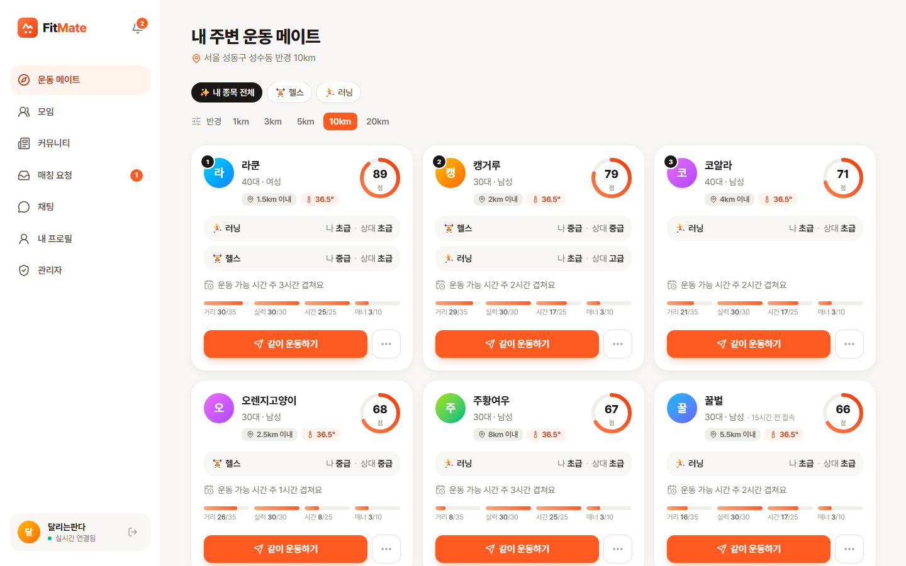

## 주요 기능

- **운동 메이트 추천**: 반경 안의 사람을 거리·실력·운동 시간·매너로 점수화(100점)해서 잘 맞는 순서로 보여 줌
- **매칭 요청 → 1:1 채팅**: 요청을 수락하면 바로 채팅방이 생기고, 실시간 메시지·읽음 표시·사진·이모티콘·접속 상태 지원
- **운동 모임**: 카카오맵에서 근처 모임을 찾고 선착순으로 참여. 만들 때는 장소를 검색하거나 지도에 핀을 찍어 고름. 모임마다 단체 채팅방, 시작 1시간 전 리마인더
- **동네 커뮤니티**: 내 반경 안의 글만 모아 보는 피드, 사진 4장, 좋아요, 댓글·답글
- **매너 온도**: 함께 운동한 상대를 평가하고 칭찬 태그를 모음. 노쇼는 점수에 반영
- **실시간 알림**: 매칭·모임·댓글·칭찬 알림을 토스트로 받고, 종류별로 끌 수 있음
- **안전**: 차단·신고, 관리자 페이지에서 신고 처리(경고·정지)와 글 숨기기
- **계정**: 가입 이메일 인증, 아이디·비밀번호 찾기, 회원 탈퇴

## 화면

| 모임 지도 | 1:1 채팅 |
|---|---|
| 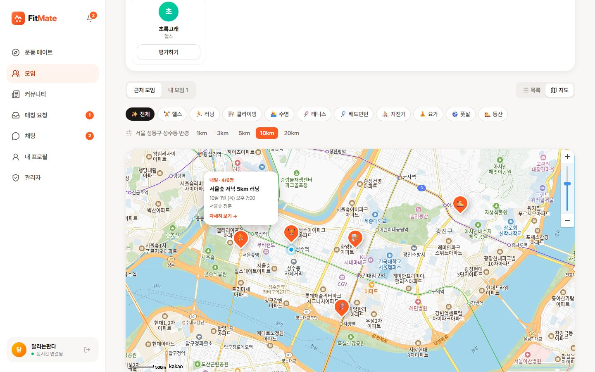 | 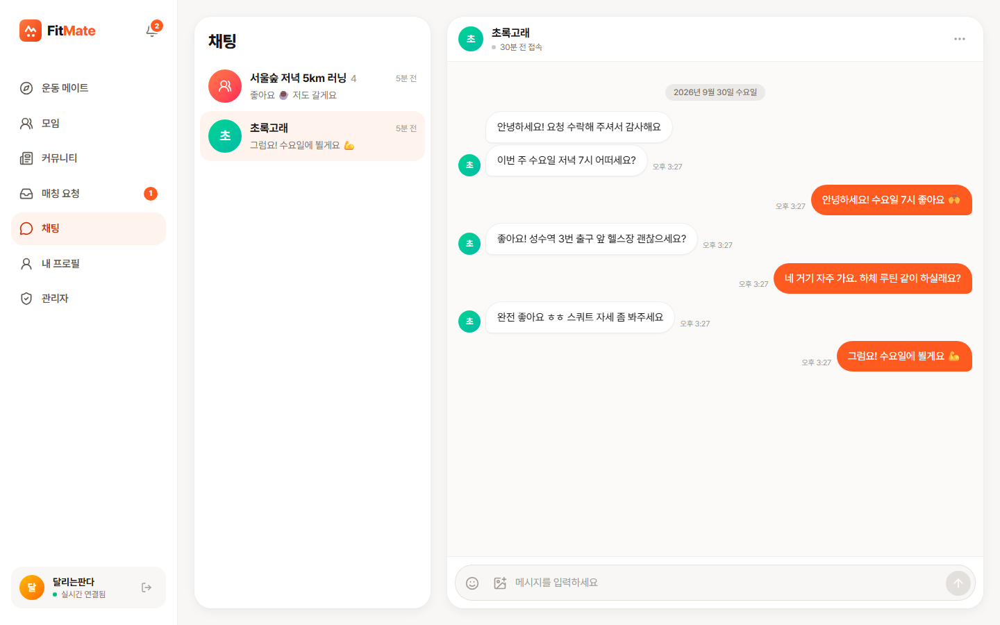 |
| **모임 단체 채팅** | **커뮤니티** |
| 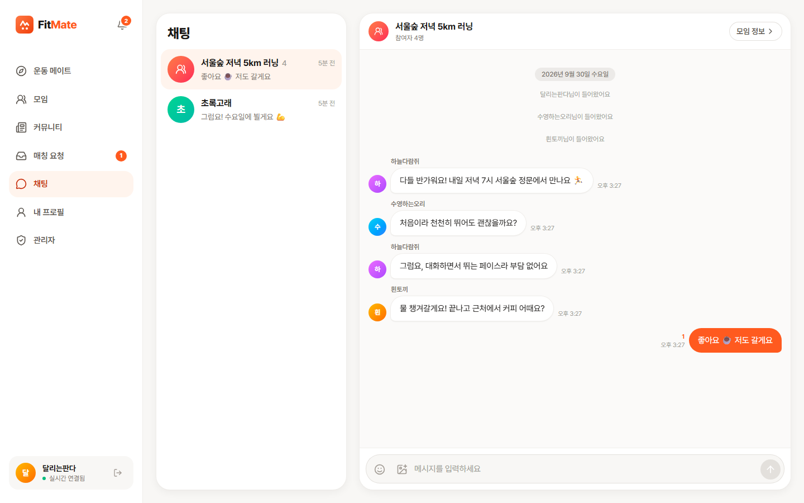 | 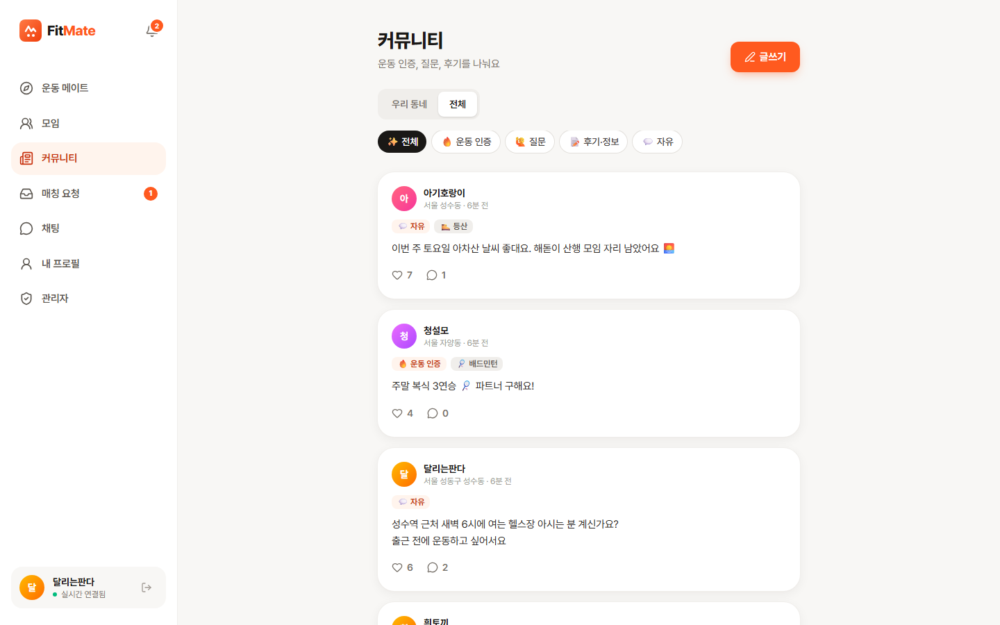 |
| **관리자 (신고 처리)** | **로그인** |
| 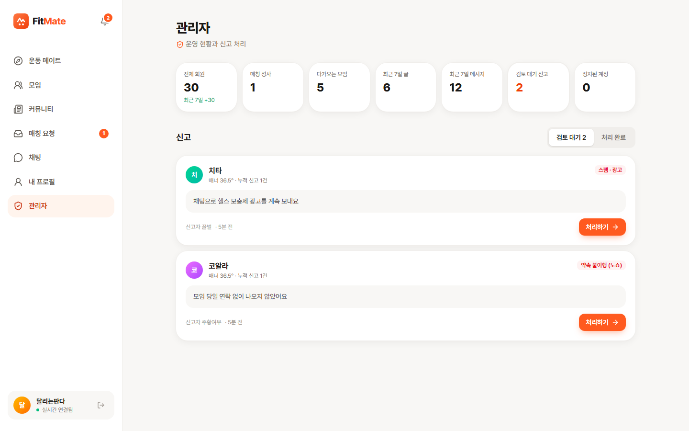 | 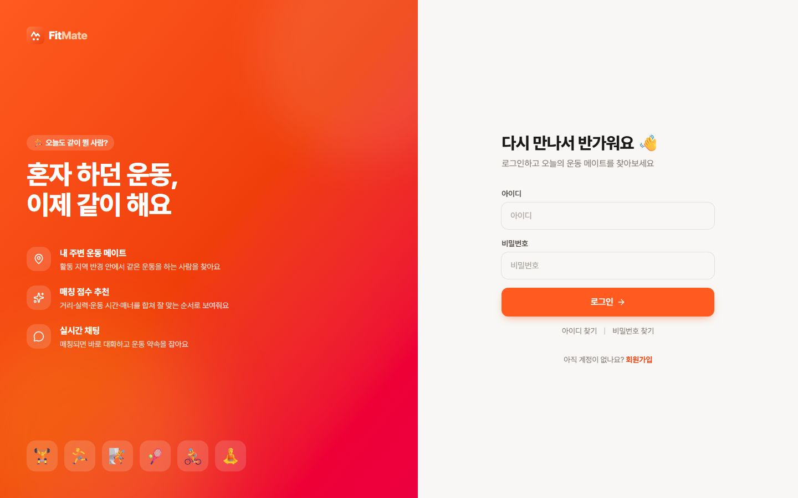 |

**모바일** (하단 탭, 하단 시트 모달)

| 운동 메이트 | 모임 상세 | 채팅 | 커뮤니티 |
|---|---|---|---|
| 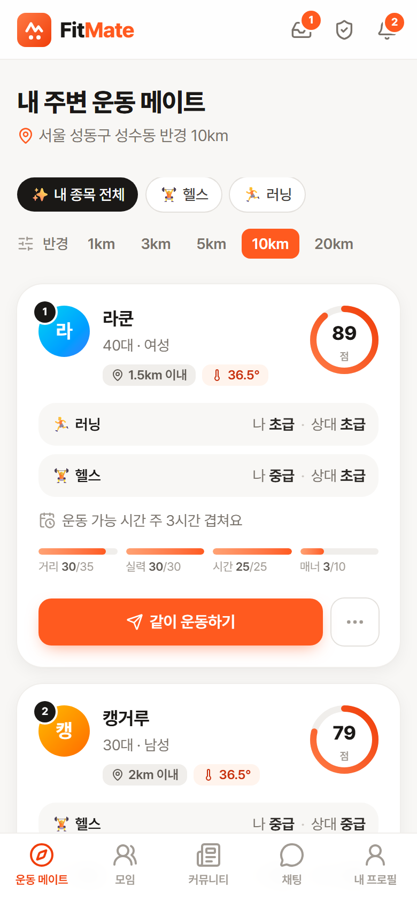 | 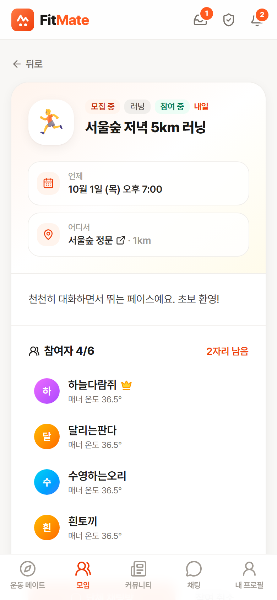 | 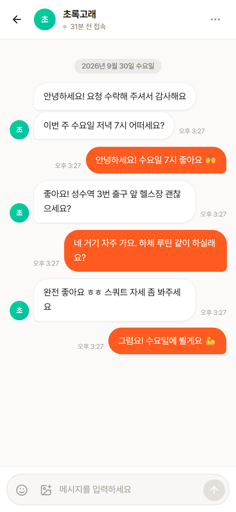 | 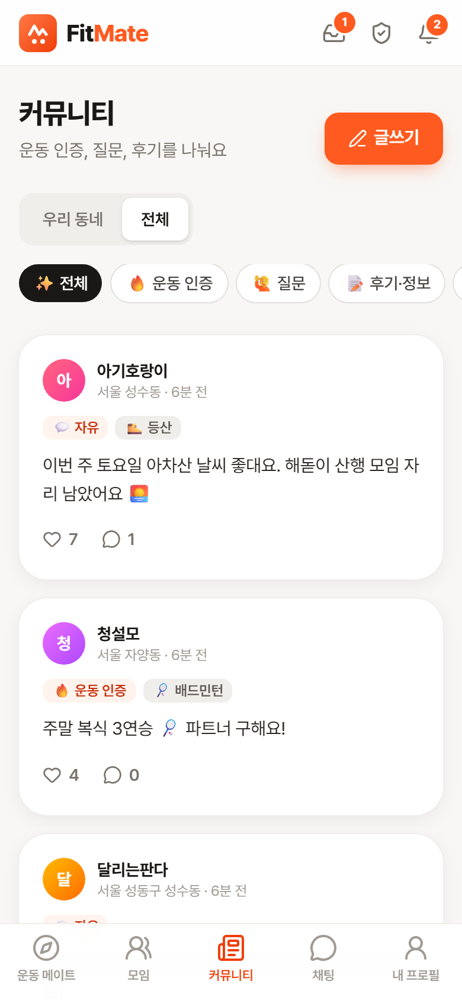 |

## 아키텍처

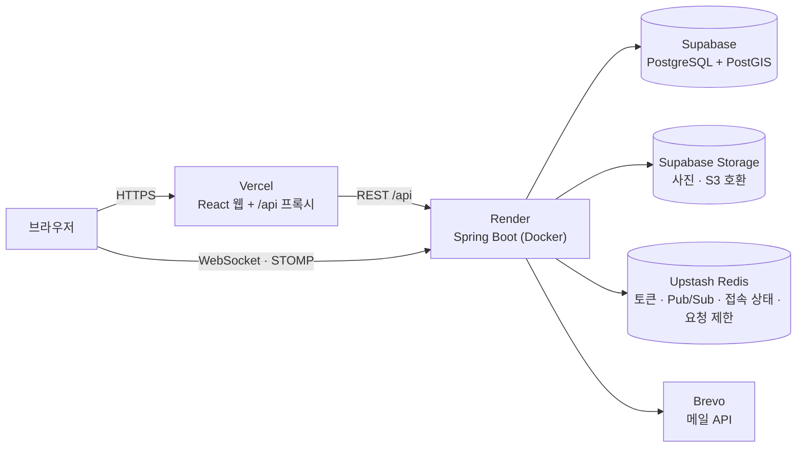

| 영역 | 기술 |
|---|---|
| Backend | Java 17, Spring Boot 4, Spring Data JPA, Spring Security (OAuth2 Resource Server, JWT), WebSocket(STOMP), Flyway |
| DB · Cache | PostgreSQL + PostGIS, Redis |
| Web | React 19, TypeScript, Vite, Tailwind CSS v4, TanStack Query, React Router, STOMP.js, 카카오맵 JavaScript SDK |
| Test | JUnit 5, Testcontainers(PostGIS · Redis · S3Mock), Playwright, k6 |
| Infra | Docker, GitHub Actions, Vercel, Render, Supabase, Upstash |

## 핵심 구현과 문제 해결

### 1. 모임 선착순 참여: 동시에 20명이 눌러도 정원만큼만
- 자리 확보를 **조건부 UPDATE 한 문장**으로 처리해서 락 없이도 정원을 넘지 않음
  ```sql
  UPDATE gatherings SET current_count = current_count + 1,
         status = CASE WHEN current_count + 1 >= capacity THEN 'CLOSED' ELSE status END
  WHERE id = ? AND status = 'RECRUITING' AND current_count < capacity AND starts_at > now()
  ```
- **테스트가 잡은 버그**: 처음엔 "참가 기록이 없으면 INSERT"로 같은 사람의 연타를 막으려 했는데, 참가자 ID를 직접 정하는 엔티티라 `save()`가 merge로 동작해서 **동시에 5번 누르면 5번 다 성공**. 자리 확보 UPDATE가 모임 행을 잠그는 점을 이용해, 그 뒤에 참가 기록을 다시 읽어 확인하도록 수정
- 검증: 정원 5명 모임에 20명 동시 참여 → 정확히 4명 성공 + 자동 마감, 한 사람 5번 연타 → 1번만 성공

### 2. 서버가 여러 대여도 동작하는 실시간 채팅
```
클라이언트 ─STOMP SEND→ 서버 A ─저장(DB)→ 커밋 후 ─PUBLISH→ Redis
                                                     ├─→ 서버 A ─→ 구독자
                                                     └─→ 서버 B ─→ 구독자
```
- **Redis Pub/Sub**으로 다른 서버에 연결된 사용자에게도 전달, `@TransactionalEventListener(AFTER_COMMIT)`로 **커밋된 메시지만** 발행
- 읽음 "1"(단체방은 안 읽은 사람 수), 접속 상태도 같은 방식. 접속 상태는 Redis 해시에 연결마다 만료 시각을 기록해서 **여러 탭**과 **서버 장애**(heartbeat 30초, 90초 지나면 정리)를 처리
- **테스트가 잡은 경쟁 상황**: 연결이 끊길 때 "연결 삭제 → 마지막 접속 기록" 순서라, 그 사이 조회하면 "오프라인인데 마지막 접속 없음"이 보임. 순서를 바꿔 해결 (WebSocket 통합 테스트)

### 3. 배포 환경에서만 생긴 버그: IP별 요청 제한이 동작하지 않음
- 로그인 시도·가입·계정 찾기에 IP별 제한을 두었는데, 배포 서버에 같은 IP로 **1분에 135번** 요청해도 한도(120번)에 걸리지 않음
- **원인**: Render 앞단의 Cloudflare 때문에 `X-Forwarded-For`가 "사용자, Cloudflare, Render 내부" 순. Tomcat은 사설 IP만 프록시로 믿어서 **Cloudflare 서버 주소를 사용자 IP로 착각**했고, Cloudflare 서버가 여러 대라 요청마다 IP가 달라짐
- **해결**: Cloudflare가 넣고 사용자가 위조할 수 없는 `CF-Connecting-IP`를 Render에서만 사용. 웹 요청은 Vercel 프록시를 거치므로, Vercel 미들웨어가 사용자 IP와 **비밀값**을 함께 보내고 API는 비밀값이 맞을 때만 그 IP를 믿음(일정 시간 비교)
- **검증**: 배포 서버에 직접 요청해서 120번째 이후 429, IP 헤더 4종을 요청마다 바꿔 위조해도 똑같이 차단, Vercel을 거친 요청이 같은 IP로 합산되는 것까지 확인

### 4. 메모리 512MB 서버에서 사진 업로드 버티기
- 512MB로 제한한 컨테이너에 사진 업로드 부하를 걸었더니 **강제 종료(OOMKilled)**. 원인은 큰 사진 여러 장을 한꺼번에 원본 크기로 펼치는 이미지 처리와 힙 밖 메모리(클래스 정보·스레드·glibc arena 약 250MB)
- 사진을 결과 크기의 2배까지만 줄여 읽기(`ImageReadParam` subsampling), 동시에 처리하는 사진 수 제한(Semaphore), 힙 40% · `MALLOC_ARENA_MAX=2` · Tomcat 스레드 30
- 결과: 10명이 사진 4장씩 5번 동시에 올려도(200장) 모두 성공, 최대 462MB, 헬스 체크 지연 없음

### 5. 토큰을 훔쳐 갈 수 없는 로그인 유지
- 액세스 토큰(30분)은 메모리에만, 리프레시 토큰(14일)은 JavaScript가 읽을 수 없는 **HttpOnly 쿠키**(`Secure; SameSite=Strict; Path=/api/auth`) → XSS로 토큰을 가져갈 수 없음
- 웹(vercel.app)과 API(onrender.com)는 다른 사이트라 쿠키가 서드파티 쿠키가 되어 **Safari가 막음** → Vercel이 `/api`를 API로 전달(rewrite)해 같은 사이트로 만들고, WebSocket만 API에 직접 연결
- 리프레시 토큰은 원문 대신 SHA-256 해시로 Redis에 저장, `GETDEL`로 꺼내면서 삭제해 **1회용**(동시 재발급 요청도 한 번만 성공). 여러 요청이 동시에 401을 받아도 웹은 재발급을 한 번만 수행

### 6. 위치 기반 추천
- `geography(POINT)` + GIST 인덱스 + `ST_DWithin`으로 반경 검색 (`EXPLAIN`으로 인덱스 스캔 확인)
- DB에서 가까운 순 200명까지 거르고 겹치는 운동 시간까지 계산 → 점수는 애플리케이션에서 계산해서 가중치를 바꾸기 쉽고 DB 없이 단위 테스트 가능
- 거리는 0.5km 단위로 올려서 보여 줘서, 여러 곳에서 거리를 재 정확한 위치를 역추적(삼각측량)하기 어렵게 함
- **시간대 버그**: `hibernate.jdbc.time_zone=UTC` 설정 때문에 운동 가능 시각(`time`)이 9시간 밀려 저장되던 문제를 발견. 설정을 없애고, 서버 시간대가 UTC인 환경에서도 재현되도록 테스트 JVM을 KST로 고정한 회귀 테스트 추가

## 테스트

| 종류 | 내용 |
|---|---|
| 백엔드 통합 테스트 **189개** | Testcontainers로 실제 PostGIS·Redis를 띄워 실행. 동시성(선착순·좋아요·매너 점수·중복 가입·토큰 재발급), WebSocket, 보안(남의 알림 큐 구독 차단 등) 포함 |
| 브라우저 E2E (Playwright) | 회원가입(메일 인증 코드) · 두 브라우저 간 실시간 채팅과 읽음 표시 · 커뮤니티 댓글 → 실시간 알림 |
| 부하 테스트 (k6) | 아래 표 |

로그인한 사용자들이 추천·피드·모임·채팅방·알림을 동시에 불러오는 상황 (로컬 PC, 데모 데이터)

| 시나리오 | 요청 수 | 처리량 | 오류 | p95 |
|---|---|---|---|---|
| 50명이 1초씩 쉬며 둘러보기 (70초) | 13,460 | 185 req/s | 0% | 11ms |
| 100명이 쉬지 않고 요청 (30초) | 54,205 | **1,683 req/s** | 0% | 76ms |

**E2E가 잡은 접근성 버그**: 성별 선택 버튼을 화면 읽기 프로그램이 모두 "성별 여성"으로 읽고 있었음(`<label>` 안에 버튼 여러 개). 버튼 묶음을 `role="group"`으로 바꾸고 선택 상태(`aria-pressed`)를 추가

## 설계 상세

<details>
<summary><b>매칭 점수 · 매칭 요청</b></summary>

**점수(100점) = 거리 35 + 실력 30 + 운동 시간 25 + 매너 10**

| 항목 | 계산 |
|---|---|
| 거리 | 가까울수록 높음, 검색 반경 끝이면 0점 |
| 실력 | 같은 수준 30 / 한 단계 차이 15 / 두 단계 차이 0 |
| 운동 시간 | 같은 요일에 겹치는 시간 합계, 주 3시간 이상이면 만점 |
| 매너 | 매너 점수 30 이하 0점 ~ 50 이상 만점 |

- **추천 제외**: 차단 관계(어느 쪽이든), 이미 매칭된 사람, 대기 중인 요청이 있는 사람을 반경 검색 SQL 안에서 `NOT EXISTS`로 제외
- **요청 처리 동시성**: 수락·거절·취소는 `SELECT ... FOR UPDATE`로 직렬화. 같은 요청을 동시에 5번 수락해도 채팅방은 1개
- **중복 요청 방지**: `status = 'PENDING'` 부분 유니크 인덱스
- **1:1 채팅방 유일성**: `"작은ID:큰ID"` 키에 유니크 제약 → 요청 방향과 상관없이 두 사람 사이에 방은 하나
</details>

<details>
<summary><b>채팅</b></summary>

- **WebSocket 인증**: 브라우저 WebSocket은 핸드셰이크에 헤더를 못 붙이므로 STOMP CONNECT 프레임에서 JWT 검증, SUBSCRIBE 때 채팅방 멤버인지 확인
- **안 읽은 수**: 멤버별 `last_read_message_id` 이후 메시지 수. 읽음 위치는 앞으로만 움직여서 늦게 도착한 요청이 최신 값을 덮어쓰지 않음
- **페이지네이션**: `id < cursor` + `(room_id, id DESC)` 인덱스 → 대화가 길어져도 일정한 속도
- **단체방**: 모임 참여·나가기에 따라 멤버가 바뀌고, 새로 들어온 사람은 이전 메시지를 안 읽은 것으로 세지 않음. 입장·퇴장 안내 메시지
- **요청 횟수 제한**: STOMP로 보낸 메시지도 REST와 같은 한도(1분 60개)를 공유
- **권한 없는 접근은 404**: 남의 요청·채팅방은 존재 여부도 노출하지 않음
- **웹**: 로그인하면 내 모든 채팅방을 구독해서 다른 화면에서도 안 읽은 수가 갱신, 연결이 끊기면 REST로 전송, 한글 IME 조합 중 Enter는 전송하지 않음
</details>

<details>
<summary><b>모임 · 매너 평가 · 리마인더</b></summary>

- **나가면 다시 모집**: 자리를 돌려주면서 마감이었으면 모집 중으로 되돌림. 나가기도 자리를 두 번 돌려주지 않게 같은 방식으로 확인
- **매너 평가 자격**: 끝난 모임(14일 이내)에 함께 참여했거나 1:1 매칭이 수락된(30일 이내) 상대만, 같은 모임·매칭에서 한 번만 (부분 유니크 인덱스)
- **매너 점수**: 좋았어요 +0.5 / 보통 0 / 별로였어요 −0.5, 노쇼 −1.0. `LEAST(99.9, GREATEST(0, manner_score + ?))` 한 문장으로 더해서 평가가 동시에 몰려도 빠지지 않음 (8명 동시 평가 테스트). 아쉬운 태그는 공개하지 않고 점수에만 반영
- **리마인더**: 1분마다 시작 1시간 전 모임에 알림, 끝나고 2시간 뒤 평가 요청. `UPDATE … WHERE reminder_sent_at IS NULL … RETURNING id`로 먼저 차지한 모임에만 보내서 **서버가 여러 대여도 한 번만** 발송 (4개 스레드 동시 실행 테스트)
</details>

<details>
<summary><b>커뮤니티 · 알림</b></summary>

- **우리 동네 글**: 글 쓸 때의 활동 지역 좌표를 저장하고 `ST_DWithin`으로 내 반경 안의 글만 조회. 화면에는 동 이름만 보여 줌
- **좋아요 동시성**: `INSERT … ON CONFLICT DO NOTHING`으로 실제로 들어갔을 때만 `like_count + 1`. 10명 동시 → 10, 한 사람 5번 연타 → 1. 화면은 누르자마자 바뀌고(낙관적 업데이트) 서버 값으로 맞춤
- **피드 N+1 방지**: 글·작성자·종목·내 좋아요 여부를 한 번의 SQL로, 사진은 글 ID 목록으로 한 번 더 조회해 붙임
- **댓글**: 한 단계 답글까지. 답글이 있는 댓글을 지우면 "삭제된 댓글"로 자리만 남김
- **알림**: DB에 저장하고 커밋 후 Redis로 발행 → 각 서버가 해당 사용자의 `/user/queue/notifications`로 전달. 변환된 실제 큐 주소를 직접 구독해 남의 알림을 엿보는 것을 막음 (테스트로 검증). 종류별로 끄면 저장·전송 모두 하지 않음
</details>

<details>
<summary><b>계정 · 보안</b></summary>

- **가입 이메일 인증**: 6자리 코드 → 30분짜리 1회용 인증 토큰 → 가입·이메일 변경 때 `GETDEL`로 확인하고 지움. 남의 이메일로 가입해 계정 찾기 메일이 엉뚱한 곳으로 가는 것을 막음
- **가입 여부 비노출**: 로그인 실패는 계정이 없을 때와 비밀번호가 틀릴 때 같은 에러. 계정 찾기는 항상 같은 응답(202)을 주고 메일은 `@Async`로 보내서 응답 시간 차이로도 알 수 없게 함
- **인증 코드**: 해시로 Redis에 저장(10분), `HINCRBY`로 시도 횟수를 세서 5번 틀리면 폐기, 같은 대상 재요청은 1분에 한 번(`SET NX EX`)
- **로그인 시도 제한**: 같은 아이디 5회 / 같은 IP 20회 실패 시 15분 잠금. 아이디만 제한하면 남의 계정을 일부러 잠글 수 있어 IP 제한을 함께 둠
- **요청 횟수 제한**: `@RateLimited(name, limit, windowSeconds)`를 붙이면 인터셉터가 사용자별(로그인 전 API는 IP별)로 셈. `INCR`과 첫 `EXPIRE`를 **Lua 스크립트 한 번**으로 실행해 서버 여러 대에서도 합산되고, 30개 동시 요청 중 정확히 한도만큼만 통과. 넘으면 429 + `Retry-After`
- **중복 가입**: 사전 검사 + DB 유니크 제약. 같은 이메일 동시 가입 10건 중 1건만 성공
- **비밀번호 변경·정지·탈퇴 시 모든 기기 로그아웃**: 사용자별 리프레시 토큰 목록(Redis Set)을 한 번에 폐기
- **회원 탈퇴**: 비밀번호 확인 후 개인정보 삭제(`ON DELETE CASCADE`), 상대방 채팅방의 대화는 남기고 보낸 사람만 비움(`SET NULL`), 사진 파일은 커밋 후 삭제
- **차단**: 추천·요청·채팅·커뮤니티에서 서로 숨김. 대기 중인 요청은 한 번의 UPDATE로 취소하고, 상대에게 차단 사실을 알리지 않음
- **메일**: 호스팅(Render)이 SMTP 포트를 막아서 배포는 Brevo HTTPS API, 로컬은 Mailpit(SMTP). 메일 내용과 발송 방법(`MailTransport`)을 분리해 설정으로 바꿔 끼움
</details>

<details>
<summary><b>관리자 · 신고 처리</b></summary>

- **관리자 지정**: `ADMIN_LOGIN_IDS` 환경 변수의 아이디를 서버 시작 때 ADMIN으로 맞춤. 권한은 요청마다 DB에서 확인해서 권한을 뺏으면 바로 막힘
- **신고 처리**: 문제 없음 / 경고 / 7일 정지 / 영구 정지. 같은 사람의 검토 대기 신고를 **조건부 UPDATE 한 번**으로 함께 처리 → 관리자 두 명이 동시에 눌러도 한 번만 반영
- 신고당한 사람에게 경고 알림(끌 수 없는 운영 알림), 신고자에게 처리 결과 알림. 정지 여부는 비밀번호가 맞을 때만 알려서 계정 존재를 떠볼 수 없게 함
- **글 숨김**: 지우지 않고 숨겨서 되돌릴 수 있음. 숨긴 글은 피드·상세·댓글에서 모두 제외
- **운영 현황**: 가입자, 최근 7일 가입·글·메시지, 매칭, 모임, 대기 신고, 정지 계정 수를 한 번의 SQL로
</details>

<details>
<summary><b>사진 업로드 · 지역 검색</b></summary>

- **브라우저에서 먼저 축소**: 긴 변 1600px JPEG로 줄이고 휴대폰 사진의 회전(EXIF)을 적용
- **서버에서 재검증·재인코딩**: 파일 앞부분(매직 넘버)으로 JPEG/PNG 확인 → 픽셀 크기를 먼저 읽어 거대한 이미지는 디코딩 전에 거절(압축 폭탄 방지) → 다시 인코딩하면서 **촬영 위치(GPS) 등 EXIF 제거**
- **DB와 저장소 일치**: 이전 파일은 커밋 후 삭제, DB 저장이 실패하면 방금 올린 파일을 롤백 시 삭제
- **저장소 추상화**: 개발은 로컬 폴더, 배포는 S3 호환 저장소(Supabase Storage)를 `STORAGE_TYPE`으로 전환. S3 구현은 S3Mock 컨테이너로 테스트
- **지역 검색**: 카카오 로컬 API(역·상호까지 검색, 결과는 Redis에 하루 캐시). 없거나 실패하면 내장 목록 **전국 3,827곳** + 주요 역·명소로 대체. 통계청 행정동 경계에서 넓이 가중 무게중심을 계산해 만들었고(`backend/scripts/generate_kr_areas.py`), "망원동"처럼 부르는 이름으로도 행정동(망원1동·망원2동)을 찾음. 저장하는 지역명은 동 단위까지만
</details>

<details>
<summary><b>ERD</b></summary>

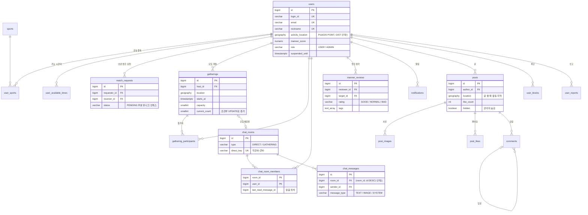
</details>

<details>
<summary><b>API 목록</b></summary>

전체 명세는 [Swagger](https://fitmate-api-dwrd.onrender.com/swagger-ui.html)에서 볼 수 있습니다.

| Method | Path | 설명 |
|---|---|---|
| POST | `/api/auth/signup` · `/login` · `/refresh` · `/logout` | 가입 · 로그인 · 토큰 재발급 · 로그아웃 |
| POST | `/api/auth/email-verification/request` · `/confirm` | 가입 이메일 인증 |
| POST | `/api/auth/find-login-id` · `/password-reset/request` · `/password-reset/confirm` | 아이디 · 비밀번호 찾기 |
| GET · PUT · PATCH | `/api/users/me` | 내 프로필 (지역 · 종목 · 운동 시간 포함) |
| GET | `/api/users/{id}` · `/api/users/{id}/manner` | 다른 사람 프로필 · 매너 온도 |
| GET | `/api/matching/recommendations` | 운동 메이트 추천 (`sportId`, `radiusKm`) |
| POST · GET | `/api/match-requests` · `/received` · `/sent` | 매칭 요청 · 목록 |
| POST | `/api/match-requests/{id}/accept` · `/reject` · `/cancel` | 수락(채팅방 생성) · 거절 · 취소 |
| GET · POST | `/api/chat-rooms` · `/{id}/messages` · `/{id}/images` · `/{id}/read` | 채팅방 · 메시지 · 사진 · 읽음 |
| POST · GET · DELETE | `/api/gatherings` · `/{id}` · `/{id}/participants` | 모임 만들기 · 상세 · 참여 · 나가기 · 취소 |
| GET · POST | `/api/manner/pending` · `/api/manner/reviews` | 평가할 상대 · 매너 평가 |
| GET · POST · PUT · DELETE | `/api/posts` · `/{id}` · `/{id}/like` · `/{id}/comments` | 커뮤니티 |
| GET · PUT · POST | `/api/notifications` · `/settings` · `/{id}/read` · `/read-all` | 알림 |
| PUT · DELETE · POST | `/api/users/{id}/block` · `/api/users/{id}/report` | 차단 · 신고 |
| GET · POST | `/api/admin/stats` · `/reports` · `/reports/{id}/resolve` · `/users/{id}/unsuspend` · `/posts/{id}/hide` | 관리자 |

**WebSocket (STOMP)** `/ws`: CONNECT 헤더에 `Authorization: Bearer <token>`. 구독 `/topic/chat-rooms/{id}`(메시지) · `/topic/chat-rooms/{id}/reads`(읽음) · `/user/queue/notifications`(알림), 전송 `/app/chat-rooms/{id}/messages`
</details>

## 로컬 실행

Docker Desktop을 켜고, 처음 한 번 `npm install` 후:

```bash
npm run dev
```

DB·Redis·Mailpit 컨테이너 → 백엔드(http://localhost:8081) → 웹(http://localhost:5173)이 한 번에 뜹니다. Windows는 `dev.cmd`를 더블클릭해도 됩니다.

- **데모 데이터**: 성수역 주변 8km에 사용자 30명, 모임 5개, 커뮤니티 글 6개, 채팅방이 만들어집니다
  - 아이디 `demo01` ~ `demo30`, 비밀번호 `password123` (로그인 화면의 "데모 계정으로 로그인" 버튼은 개발 모드에만 있음. 비밀번호가 공개돼 있으므로 배포 서버에서는 데모 계정 로그인·계정 찾기를 막음)
  - `demo01`(달리는판다)은 관리자이고, `demo02`(초록고래)와 대화 중, `demo03`(노란병아리)에게 매칭 요청을 받은 상태
- Swagger http://localhost:8081/swagger-ui.html · 메일함(Mailpit) http://localhost:8025

| 명령 | 설명 |
|---|---|
| `npm run test:api` | 백엔드 테스트 (Docker 필요) |
| `npm run test:e2e` | 브라우저 E2E (`npm run dev`가 켜져 있어야 함) |
| `docker run --rm -i -e BASE_URL=http://host.docker.internal:8081 grafana/k6 run - < scripts/k6/browse.js` | 부하 테스트 |

배포 방법은 **[DEPLOY.md](DEPLOY.md)** 에 있습니다 (`main`에 푸시하면 자동 배포).

## 프로젝트 구조

```
fitmate/
├─ backend/               Spring Boot API (도메인별 패키지: matching, chat, gathering, community, ...)
│  └─ src/main/resources/db/migration   Flyway 마이그레이션
├─ apps/web/              React 웹
│  ├─ middleware.ts       Vercel 미들웨어 (사용자 IP 전달)
│  └─ e2e/                Playwright E2E
├─ scripts/k6/            부하 테스트
├─ docker-compose.yml     로컬 PostgreSQL(PostGIS) · Redis · Mailpit
└─ render.yaml            Render 배포 설정 (Blueprint)
```

## 데이터 출처

행정구역 검색 목록(`backend/src/main/resources/locations/kr-areas.csv`)은 통계청 통계지리정보서비스(SGIS)에서 공공누리 제1유형으로 개방한 행정동 경계를 가공한 것(가공: [vuski/admdongkor](https://github.com/vuski/admdongkor), CC BY 4.0)에서 중심 좌표를 계산해 사용합니다.
