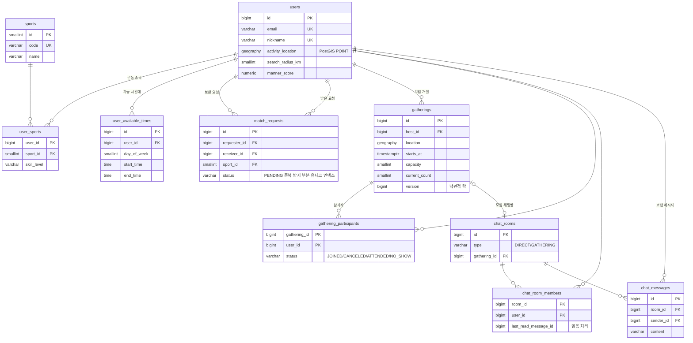

# FitMate

동네 운동 친구를 찾는 매칭, 채팅, 커뮤니티 서비스 (웹 + 앱)

## 기술 스택

| 영역 | 기술 |
|---|---|
| Backend | Java 17, Spring Boot 4, Spring Data JPA, Spring Security, WebSocket(STOMP), Flyway |
| DB / Cache | PostgreSQL + PostGIS, Redis |
| Web | React, Vite, TypeScript |
| App | React Native (Expo) — 예정 |
| 배포 | Vercel(웹), Railway/Render(API), Supabase(DB), Upstash(Redis), Expo EAS(앱) |

## 프로젝트 구조

```
fitmate/
├─ backend/            Spring Boot API 서버
├─ apps/
│  ├─ web/             React 웹
│  └─ mobile/          React Native 앱 (예정)
├─ packages/           웹/앱 공유 코드 (OpenAPI 클라이언트 등, 예정)
└─ docker-compose.yml  로컬 PostgreSQL(PostGIS) + Redis
```

## 로컬 실행

```bash
# 1. DB, Redis 실행
npm run infra:up

# 2. 백엔드 (http://localhost:8081, Swagger: /swagger-ui.html)
cd backend && ./gradlew bootRun

# 3. 웹 (http://localhost:5173)
npm install
npm run dev:web
```

## ERD



### 설계 포인트
- **위치 기반 검색**: `geography(POINT)` + GIST 인덱스로 `ST_DWithin` 반경 검색
- **중복 매칭 요청 방지**: `status = 'PENDING'` 부분 유니크 인덱스로 동시 요청도 DB에서 차단
- **모임 정원 동시성**: `current_count <= capacity` 체크 제약 + 버전 컬럼(낙관적 락), 이후 Redis 분산 락과 비교 예정
- **채팅 페이지네이션**: `(room_id, id DESC)` 인덱스 기반 커서 페이지네이션
- **읽음 처리**: 멤버별 `last_read_message_id`로 안 읽은 메시지 수 계산
